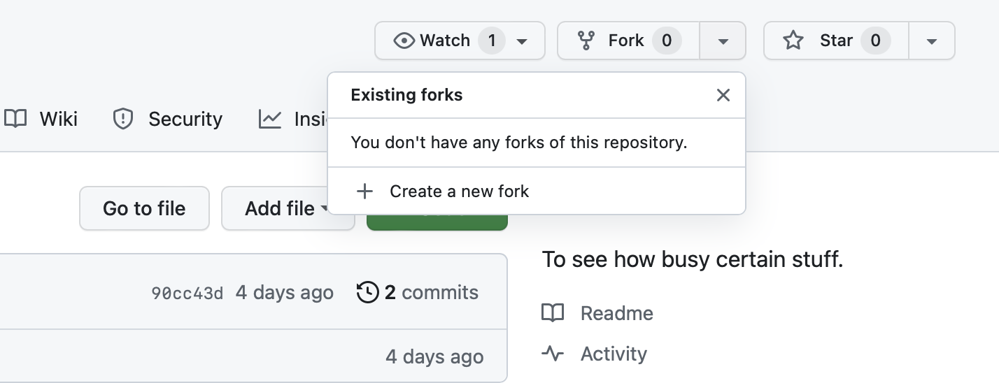
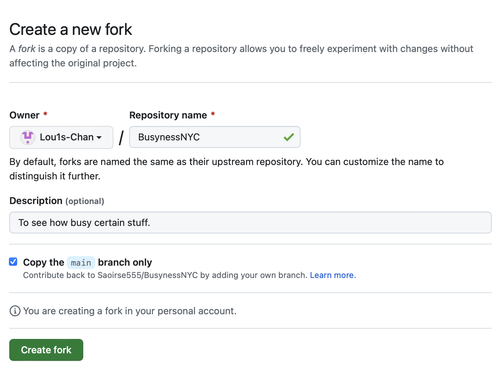
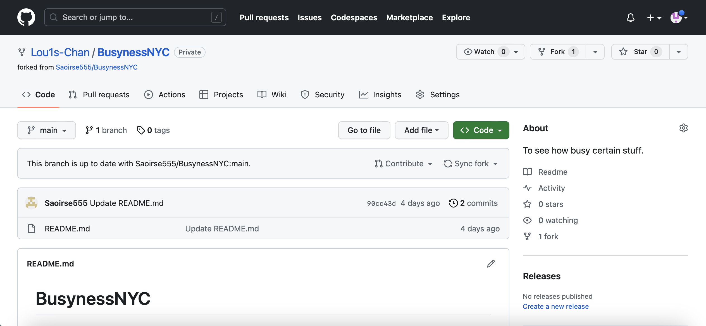
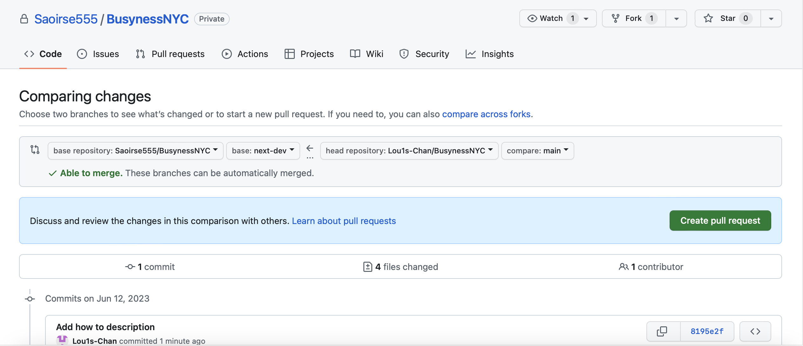
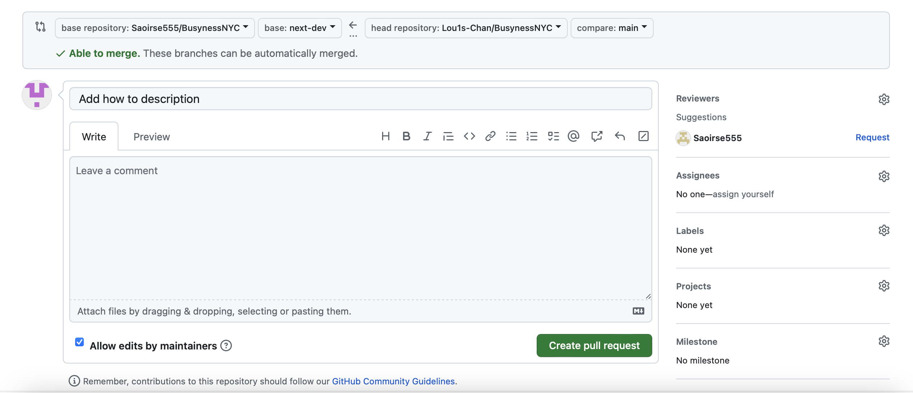

# BusynessNYC
To check how busy NYC is at a certain time 

## How to contribute to BusynessNYC?
1. Fork repository from upstream, which is Saoirse's repository here.

2. Clone the project files from your own repository, and work with them. All of your work should sync with your own repository but not Saoirse's.

3. When you think your work is ready to merge, open the Pull Request, then click 'compare across forks'. Remember to change target base from 'main' to 'next-dev', then you will see the differencies between the upstream developing branch and your own branch. 

4. Before you 'Create pull request'. You can change 'Reviewers' to maintenance lead, which is 'Lou1s-Chan' here, and click 'Request' to send a review-required notification.

5. In every Thursday, 'next-dev' branch will merge to 'main' branch.

6. Saoirse's repository should never be touched directly if not needed to.
